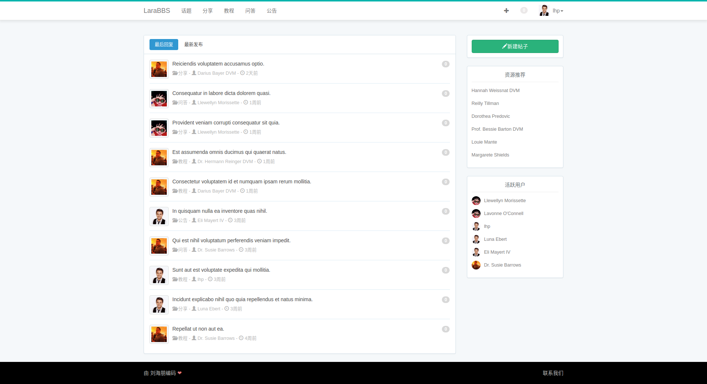
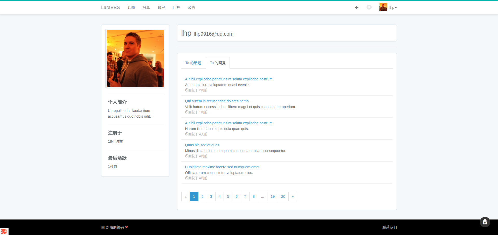
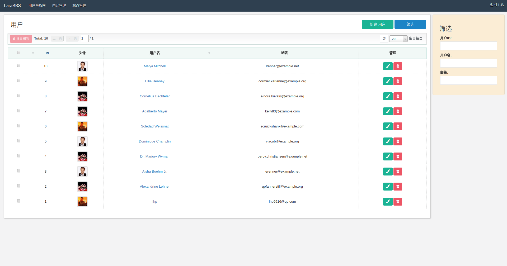
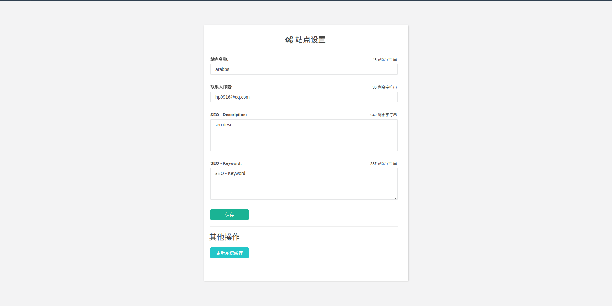

## LaraBBS
这是一个基于 Laravel 的论坛系统。

主要用到的库有

- guzzlehttp/guzzle
- hieu-le/active
- intervention/image
- laravel/horizon
- mews/captcha
- overtrue/laravel-lang
- overtrue/pinyin
- predis/predis
- spatie/laravel-backup
- spatie/laravel-permission
- summerblue/administrator
- viacreative/sudo-su

### 项目截图

